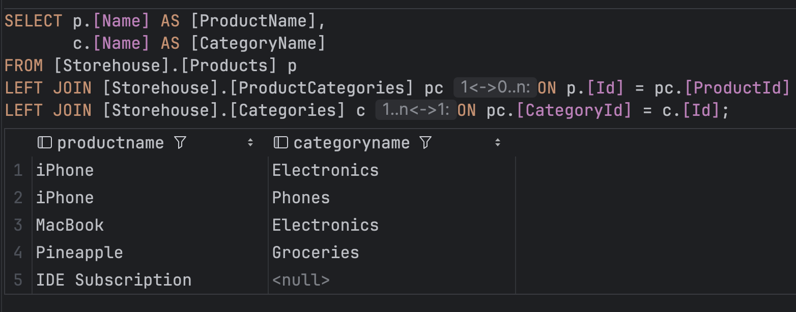

# Mindbox Entry Issue
Задание для отклика на вакансию C# developer middle (.net, back-end)

## Stack
- .NET 9
- xUnit
- FluentAssertions
- MSSQL Server
- Docker

## Задание
### Часть 1
#### Описание
Напишите на C# библиотеку для поставки внешним клиентам, которая умеет вычислять площадь круга по радиусу и треугольника по трем сторонам. 
Дополнительно к работоспособности оценим:
- Юнит-тесты.
- Легкость добавления других фигур.
- Вычисление площади фигуры без знания типа фигуры в compile-time.
- Проверку на то, является ли треугольник прямоугольным

#### Решение
- Код библиотеки содержится в `src/Geometry` - [перейти](src/Geometry)
- Юнит-тесты лежат в проекте `tests/Geometry.Tests` - [перейти](tests/Geometry.Tests)
- Легкость добавления новых фигур достигается за счет интерфейса `IFigure`: добавляется новый класс, реализующий интерфейс, предыдущий код остается неизменным.
- Вычисление площади фигуры без знания типа фигуры в compile-time также реализуется за счет `IFigure`:
  ```csharp
  IFigure compileTimeUnknownFigure = figureFactory.Create();
  Console.WriteLine(compileTimeUnknownFigure.Area);
  ```
- Проверка на то, является ли треугольник прямоугольным - [перейти](src/Geometry/Figures/Triangle.cs#L40-L53)

### Часть 2
#### Описание
В базе данных MS SQL Server есть продукты и категории. 
Одному продукту может соответствовать много категорий, в одной категории может быть много продуктов. 
Напишите SQL запрос для выбора всех пар «Имя продукта – Имя категории».
Если у продукта нет категорий, то его имя все равно должно выводиться.

#### Решение
Базу поднимается в Docker контейнере через `docker compose up`.
<br />
Скрипт инициализации данных - [перейти](sql/init.sql).
<br />
Запрос можно посмотреть по [ссылке](sql/product-categories-query.sql) или на скриншоте вместе с результатом:

